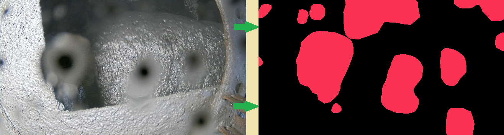

# Проект для Хакатона от [Хакатон Норникель трек "Грязные дела" 2024](https://nornickel-hackathon.ru/): 

**Задача:**
Не дай грязи испортить кадр: найди способ определения загрязнения!

Загрязненные линзы камер могут серьезно повлиять на качество работы алгоритмов компьютерного зрения. В этой задаче необходимо разработать метод определения степени загрязнения кадра, чтобы обеспечить надежную работу камер на производстве. Решение этой проблемы поможет повысить точность и эффективность различных систем, зависящих от визуальных данных.

## Проблематика 
Алгоритмы компьютерного зрения решают много задач на наших производствах. Если линза камеры загрязнена, то точность и корректность работы алгоритмов может очень сильно снизиться. Поэтому необходимо решение, отслеживающее загрязнение линз.

## Образ решения
Цель данного кейса – создать решение, которое сможет определять факт (а по возможности еще и степень) загрязнения камеры. Учтите, что оцениваться будут не только (и не столько) классические подходы с сегментационными моделями, но что-то новое и уникальное, в особенности те решения, которые покажут результат лучший, чем у бейзлайна.

## Примерное решение

## Обучение модели
Для запуска обучения модели обратитесь к инструкции [запуск обучения модели](train_code/README.md). Внутри этой папки находится README файл с дополнительной информацией о процессе обучения.

## Сервисы
После выполнения вышеперечисленных этапов, у нас имеется один сервис в папке `services`:
- **FastAPI**: Сервер на fastapi.

## Запуск сервисов
Для запуска сервисов необходимо следовать инструкциям в соответствующих репозиториях.

---

**Примечание:** Подробная информация о запуске и использовании каждого сервиса будет предоставлена в соответствующих репозиториях проекта.